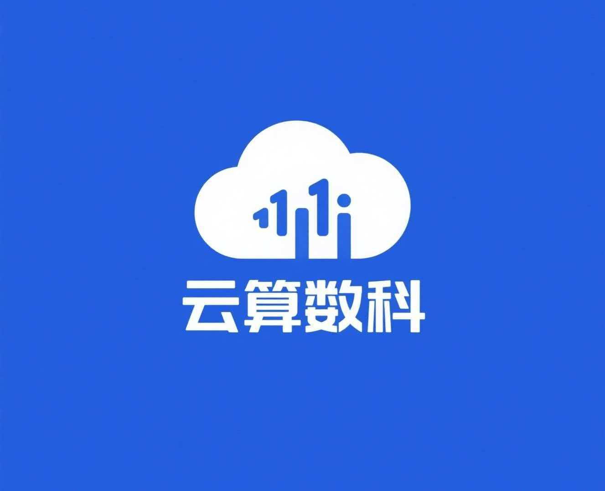
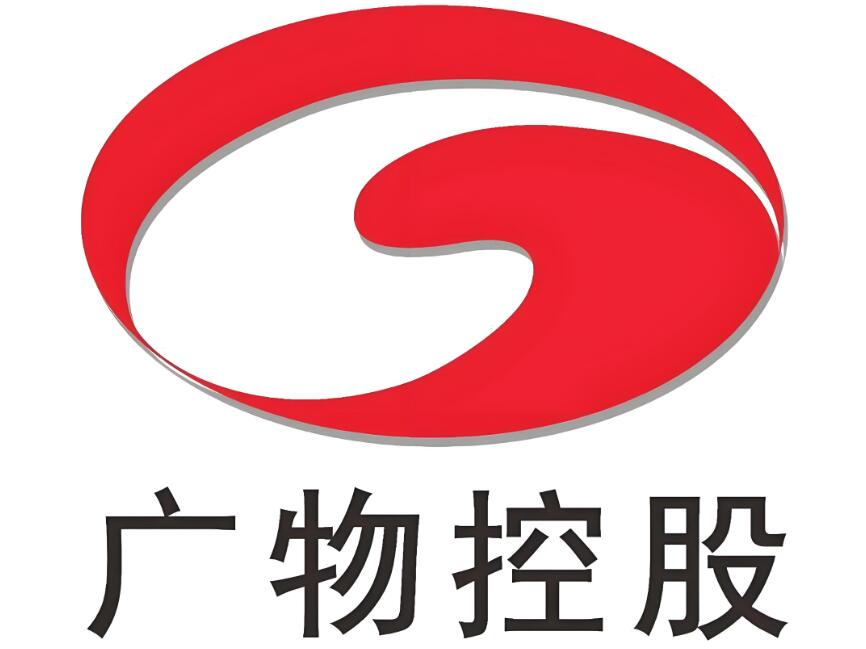
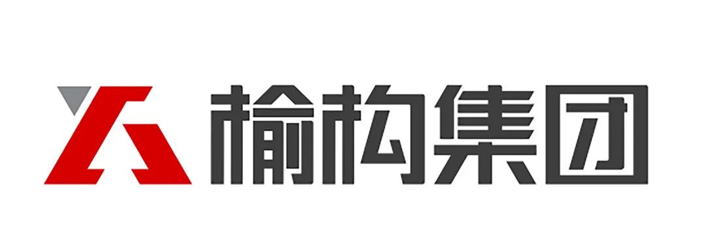
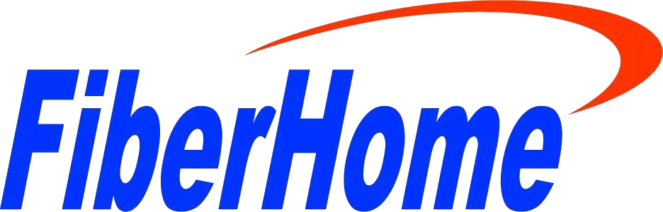
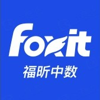

  <section class="astron-cases__hero">
    Customer Stories
    <h1>用户案例</h1>
    

      聚焦真实企业落地过程，展示 Astron Agent 如何从智能分析、工作流编排到 RPA 执行，
      在金融、电信、制造、园区运营等场景中形成可上线、可复制、可扩展的业务成果。
    

    

      Agent + RPA
      内网与私有化
      知识库与客服
      数据清洗与自动化
    

    

      <article>
        <strong>10+</strong>
        带 logo 的企业案例
      </article>
      <article>
        <strong>4 类</strong>
        核心落地方向
      </article>
      <article>
        <strong>多行业</strong>
        覆盖金融、电信、制造、园区等场景
      </article>
    

  </section>

  <section class="astron-cases__section">
    

      Landing Focus
      <h2>典型落地方向</h2>
      
从信息理解到流程执行，Astron Agent 的落地价值主要集中在以下四类方向。

    

    

      <article class="astron-cases__pillar">
        <h3>智能分析与决策</h3>
        
面向非结构化数据清洗、市场分析和企业知识问答，让信息处理从人工整理转向智能提炼。

      </article>
      <article class="astron-cases__pillar">
        <h3>Agent + RPA 协同执行</h3>
        
覆盖业务受理、订单处理、业务稽核、邮件和 Excel 自动化，让智能体真正完成执行闭环。

      </article>
      <article class="astron-cases__pillar">
        <h3>私有化与内网适配</h3>
        
适配金融、电信、制造和涉密网络环境，兼顾高安全要求、复杂网络和存量系统集成。

      </article>
      <article class="astron-cases__pillar">
        <h3>二次开发与共建</h3>
        
支持围绕 SSO、企微集成、插件扩展和 Skill 演进持续建设企业自己的智能体能力。

      </article>
    

  </section>

  <section class="astron-cases__section">
    

      Case Gallery
      <h2>企业案例一览</h2>
      
以下案例基于项目沟通记录整理，统一从业务视角提炼为场景、落地方式与阶段成果。

    

    

      <article class="astron-case-card">
        

          
          

            <h3>东华软件</h3>
            
金融行业方案验证

          

        

        

          金融数据处理Agent + RPA
        

        
<strong>业务场景：</strong>银行征信数据归集、反洗钱报告生成，探索面向金融行业的智能体与自动化能力。

        
<strong>落地方式：</strong>补齐认证、容器部署、模型授权和 RPA 架构配置，串起可验证的业务闭环。

        
<strong>阶段成果：</strong>较快完成金融核心场景验证，为后续 OEM 与行业复制打下基础。

      </article>

      <article class="astron-case-card">
        

          
          

            <h3>中国电信苏州分公司</h3>
            
内网业务受理与稽核

          

        

        

          电信内网部署业务稽核
        

        
<strong>业务场景：</strong>自动业务受理、业务稽核，全部运行在企业内网环境。

        
<strong>落地方式：</strong>围绕验证码识别、复杂页面定位和内网依赖注入，形成隔离网络下的实施方案。

        
<strong>阶段成果：</strong>推动核心流程进入灰度试运行，跑通高安全场景下的业务闭环。

      </article>

      <article class="astron-case-card">
        

          
          

            <h3>云算数字科技</h3>
            
智慧园区客服与数据分析

          

        

        

          园区运营数据清洗生产上线
        

        
<strong>业务场景：</strong>智慧园区客服、竞品与热点分析、非结构化订单数据清洗。

        
<strong>落地方式：</strong>利用大模型和 Prompt 将复杂文本转成结构化 JSON，并通过工作流写回业务系统。

        
<strong>阶段成果：</strong>实现市场洞察自动化、客户服务智能化和数据录入闭环。

      </article>

      <article class="astron-case-card">
        

          
          

            <h3>小趣科技</h3>
            
开发环境与二次开发调试

          

        

        

          研发支持前后端分离开源版
        

        
<strong>业务场景：</strong>RPA 二次开发调试、前后端分离开发部署。

        
<strong>落地方式：</strong>明确开源版支持前后端分离开发模式，帮助团队以更灵活的方式调试源码。

        
<strong>阶段成果：</strong>消除部署不确定性，加快环境搭建和二次开发启动速度。

      </article>

      <article class="astron-case-card">
        

          
          

            <h3>山东云谷</h3>
            
财务自动化与 OCR 扩展

          

        

        

          软件服务财务自动化OCR 扩展
        

        
<strong>业务场景：</strong>财务系统自动化、自动化测试、验证码与 OCR 扩展。

        
<strong>落地方式：</strong>排查环境冲突带来的拾取异常，提供第三方 OCR 接入路径和流程配置建议。

        
<strong>阶段成果：</strong>完成业务环境下的可行性验证，为核心流程后续上线建立基础。

      </article>

      <article class="astron-case-card">
        

          
          

            <h3>广物互联</h3>
            
企微集成与规划型 Agent 探索

          

        

        

          企业服务SSO规划能力
        

        
<strong>业务场景：</strong>企业微信集成、单点登录、具备规划能力的智能体应用探索。

        
<strong>落地方式：</strong>快速定位多组织登录问题，明确企微扫码登录、SSO 和规划能力的推进路径。

        
<strong>阶段成果：</strong>保证基础环境可用，帮助客户尽快明确后续集成与共建方向。

      </article>

      <article class="astron-case-card">
        

          
          

            <h3>北京榆构</h3>
            
企业知识库与数字人导览

          

        

        

          制造业知识库私有化
        

        
<strong>业务场景：</strong>企业私有知识库、数字人导览、智能体应用与 RPA 联动。

        
<strong>落地方式：</strong>围绕容器稳定性、Nginx/HTTPS、Casdoor 登录和联合部署链路完成排障。

        
<strong>阶段成果：</strong>在内网环境搭建起知识库和智能体底座，推动项目进入真实业务验证阶段。

      </article>

      <article class="astron-case-card">
        

          
          

            <h3>烽火通信科技</h3>
            
离线环境自动化与系统联动

          

        

        

          通信离线内网Open API
        

        
<strong>业务场景：</strong>离线内网 RPA 自动化、界面录制回放、内网 AI 模型接入、与 Jenkins 等系统联动。

        
<strong>落地方式：</strong>打通离线镜像导入、模拟人工输入、动态元素定位、自定义 AI 模型和 Open API 对接。

        
<strong>阶段成果：</strong>验证 Astron 在高安全隔离环境中的部署可行性，并为后续系统扩展留出接口。

      </article>

      <article class="astron-case-card">
        

          
          

            <h3>厦门福昕中数</h3>
            
数智员工与工作流编排

          

        

        

          软件产品工作流共建反馈
        

        
<strong>业务场景：</strong>数智员工智能体、插件集成、工作流编排与 RPA 私有化部署。

        
<strong>落地方式：</strong>通过代码节点绕过接口限制，支持现有后端系统联调，并围绕 Skill 与任务拆分持续共建。

        
<strong>阶段成果：</strong>保障关键接口联调推进，同时沉淀多项可复用的产品反馈和共建成果。

      </article>

      <article class="astron-case-card">
        

          
          

            <h3>襄阳东昇</h3>
            
订单接收与办公自动化

          

        

        

          制造配套邮件自动化Excel 自动化
        

        
<strong>业务场景：</strong>订单自动接收、邮件附件自动下载处理、共享文件夹 Excel 自动化。

        
<strong>落地方式：</strong>针对邮件组件、Excel 实例调度、路径转义和网页组件问题提供源码级修复与实施指导。

        
<strong>阶段成果：</strong>打通订单接收关键链路，提升无人值守运行稳定性，持续替代重复性办公工作。

      </article>
    

  </section>

