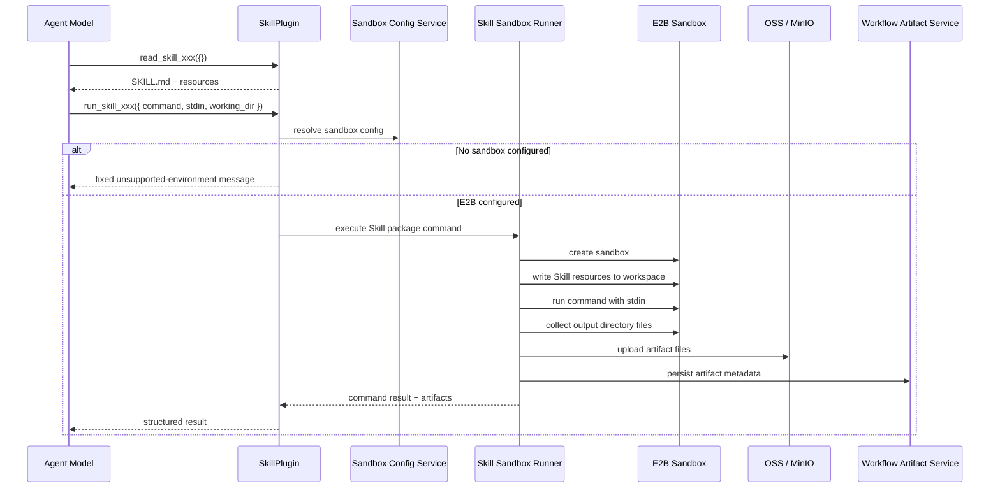

# Skill Sandbox Execution Design

Date: 2026-05-13

## Summary

Astron Agent should allow Agent workflow nodes to execute scripts that are packaged inside a Skill directory. The Skill file system already supports non-Markdown resources such as `.py` files, but the runtime currently exposes Skills as readable text resources only. This design adds a default `run_skill_xxx` tool beside the existing `read_skill_xxx` tool and routes script execution through a configurable sandbox provider.

The first sandbox provider is E2B, implemented through the official `e2b` Python SDK. If no script sandbox is configured, `run_skill_xxx` returns a fixed model-readable message instead of raising a runtime error:

```text
当前环境未配置脚本沙箱，暂不支持直接执行 Skill 脚本。你可以向用户说明需要管理员在资源管理中配置脚本沙箱后才能运行。
```

Generated files are treated as workflow runtime artifacts, not Skill source files. They are copied out of the sandbox, stored in OSS, and shown in a new workflow file view next to the existing workflow analysis tab.

## Goals

- Generate `run_skill_xxx` for every imported Skill by default.
- Keep `SKILL.md` in the standard format; do not add a required `runtime` field.
- Let the model decide whether to call `run_skill_xxx`, based on the instructions written in `SKILL.md`.
- Let the model provide the command to execute, such as `python -m scripts.clean_csv`.
- Execute commands through a sandbox provider, starting with E2B.
- Add resource-management UI for script sandbox configuration.
- Save sandbox-generated files to OSS and expose them in the workflow UI.
- Preserve current `read_skill_xxx` behavior.

## Non-Goals

- Do not infer or special-case script entry points such as `scripts/main.py`.
- Do not execute Skill scripts inside the `core/agent` service process.
- Do not write generated files back into the Skill file system.
- Do not support multiple sandbox providers in the first implementation, beyond the provider interface needed for future extension.
- Do not add dependency installation or package-lock management in this first version.

## Current System

Skill files are managed by `console/backend/toolkit` and exported as importable Skill definitions. A Skill entry is discovered through `SKILL.md`; sibling files are exported as resources with relative paths and presigned download URLs.

At runtime, `core/agent/service/plugin/skill.py` creates `read_skill_xxx`, which downloads `SKILL.md` or a named resource and returns text content. There is no executable Skill tool today.

## Target Behavior

For each Skill import, the Agent runtime creates two tools:

- `read_skill_{skill_id}`: read `SKILL.md` and resources.
- `run_skill_{skill_id}`: execute a model-provided command in the configured script sandbox.

The expected model flow is:

1. Call `read_skill_xxx` with empty input to read `SKILL.md` and resource manifest.
2. Follow the procedure described in `SKILL.md`.
3. If the procedure requires script execution, call `run_skill_xxx`.
4. Use stdout, stderr, result JSON, and artifact metadata returned by `run_skill_xxx` to answer the user.

The platform does not need to understand the script semantics. It only stages files, executes the command, captures output, and persists artifacts.

## `run_skill_xxx` Tool Contract

Tool name:

```text
run_skill_{skill_id}
```

Tool description:

```text
Execute a command from Skill '{name}' in the configured script sandbox. Read SKILL.md first and follow its instructions before choosing the command. If the environment has no script sandbox configured, this tool returns a fixed unsupported-environment message.
```

Parameters:

```json
{
  "type": "object",
  "properties": {
    "command": {
      "type": "string",
      "description": "Command to execute in the Skill workspace, for example python -m scripts.clean_csv. Choose this from SKILL.md instructions."
    },
    "stdin": {
      "description": "Optional JSON-serializable input to pass to the command stdin."
    },
    "working_dir": {
      "type": "string",
      "description": "Optional relative working directory under the Skill workspace. Defaults to the Skill workspace root."
    },
    "output_dir": {
      "type": "string",
      "description": "Optional relative output directory to collect generated files from. Defaults to output."
    }
  },
  "required": ["command"]
}
```

Result:

```json
{
  "skill_id": "123",
  "sandbox_provider": "e2b",
  "configured": true,
  "command": "python -m scripts.clean_csv",
  "working_dir": ".",
  "exit_code": 0,
  "stdout": "...",
  "stderr": "...",
  "result_json": {},
  "artifacts": [
    {
      "id": 1001,
      "file_name": "cleaned.csv",
      "file_size": 12345,
      "content_type": "text/csv",
      "download_url": "https://...",
      "workflow_id": 200,
      "run_id": "debug-run-id",
      "node_id": "agent-node-id"
    }
  ]
}
```

When sandbox execution is unavailable:

```json
{
  "skill_id": "123",
  "configured": false,
  "message": "当前环境未配置脚本沙箱，暂不支持直接执行 Skill 脚本。你可以向用户说明需要管理员在资源管理中配置脚本沙箱后才能运行。"
}
```

## Execution Flow



## Sandbox Configuration

Add a resource-management tab for script sandbox configuration. The UI should sit under resource management and be visually consistent with the current enterprise console style: compact forms, clear status, low decoration, and table/list controls for operational content.

Fields:

- Provider: `E2B` in the first version.
- Enabled: boolean switch.
- API Key: password input; never return the plaintext value to the frontend.
- Timeout seconds: default command timeout.
- Network access: optional boolean; default should be disabled unless product policy says otherwise.
- Test connection: calls backend to create a short-lived sandbox and run a trivial command.
- Last test result: status, time, and error summary.

Backend APIs:

- `GET /skill-sandbox/config`: return masked provider config.
- `PUT /skill-sandbox/config`: save provider config.
- `POST /skill-sandbox/test`: verify the current or submitted config.

Storage:

- Config should be scoped by `space_id` when a space exists, otherwise by user.
- API keys must be encrypted or stored through the existing secret-storage pattern if the project already has one.
- Frontend receives only masked values, such as `sk-****abcd`.

## E2B Provider

The first provider uses the official `e2b` Python SDK.

Relevant official SDK capabilities:

- `AsyncSandbox.create()` creates a sandbox.
- `sandbox.commands.run(...)` executes commands and captures stdout/stderr.
- `sandbox.files.write(...)` writes files into the sandbox filesystem.
- `sandbox.files.read(...)` reads files from the sandbox filesystem.

Implementation outline:

1. Create a `SandboxProvider` interface in `core/agent`.
2. Add `E2BSandboxProvider` using `from e2b import AsyncSandbox`.
3. Create a sandbox with metadata for `skill_id`, `workflow_id`, `run_id`, and `node_id`.
4. Stage Skill resources under a workspace directory, for example `/home/user/skill`.
5. Execute the model-provided command with `cwd` resolved inside that workspace.
6. Pass `stdin` as JSON when provided.
7. Collect stdout, stderr, exit code, and output files.
8. Kill or let the sandbox expire after execution according to E2B lifecycle settings.

Use the SDK rather than handwritten E2B HTTP calls.

References:

- https://e2b.dev/docs
- https://e2b.dev/docs/sdk-reference/python-sdk/v2.15.0/sandbox_async
- https://e2b.dev/docs/filesystem/read-write

## Command and Path Safety

Because the command is model-provided, the platform should constrain the execution environment rather than try to parse every command safely.

Rules:

- `working_dir` must be a relative path inside the staged Skill workspace.
- `output_dir` must be a relative path inside the staged Skill workspace.
- Resource paths must be normalized with `/` and must not escape the workspace.
- Commands run only in the sandbox, never on the host.
- The sandbox receives only Skill resources and explicit input, not host credentials.
- Secrets such as the E2B API key are not passed into the sandbox by default.
- stdout/stderr should be size-limited before returning to the model.
- Artifact count, file size, and total output size should be limited.

## Workflow Artifacts

Generated files are workflow runtime artifacts.

Default output directory:

```text
output
```

If `run_skill_xxx.output_dir` is provided, collect from that relative directory instead. The Skill author can document the expected output directory in `SKILL.md`.

Artifact collection:

1. After command completion, inspect the output directory.
2. Skip directories and oversized files.
3. Read file content from the sandbox.
4. Upload file content to OSS.
5. Persist artifact metadata.
6. Return artifact metadata to the model.

Suggested metadata table:

```text
workflow_artifact
```

Columns:

- `id`
- `uid`
- `space_id`
- `workflow_id`
- `run_id`
- `node_id`
- `skill_id`
- `file_name`
- `object_key`
- `content_type`
- `file_size`
- `source`
- `deleted`
- `create_time`
- `update_time`

Suggested `source` value for this feature:

```text
skill_sandbox
```

Required backend APIs:

- `GET /workflow/{workflowId}/artifacts`: list active files for a workflow.
- `GET /workflow/artifacts/{artifactId}/download`: download or return a presigned URL.
- `DELETE /workflow/artifacts/{artifactId}`: soft delete the artifact and remove or schedule removal of the OSS object.

Access control:

- Listing, downloading, and deleting artifacts must check workflow ownership and space access.
- A deleted artifact should not appear in the workflow file tab.

## Workflow UI

Add a new top-level workflow tab to the right of the existing analysis tab. In the screenshot, this is the red-box area between analysis and the right-side action controls.

Suggested tab label:

```text
文件
```

Route shape should follow the existing workflow tabs. If current tabs are:

```text
/work_flow/:id/arrange
/work_flow/:id/overview
```

add:

```text
/work_flow/:id/files
```

The file page should provide:

- File list table.
- Filename.
- Source node or Skill name when available.
- File size.
- Created time.
- Actions: download, delete.
- Empty state explaining that sandbox-generated files will appear here after workflow debugging or running.

UI guidance from `ui-ux-pro-max`:

- Keep the page operational and compact.
- Use table/list controls instead of decorative cards.
- Use stable hover states and visible focus states.
- Avoid layout shift in tab and action buttons.

## Context Propagation

The runtime must pass workflow context to `run_skill_xxx` so artifacts can be attached to the correct workflow.

Required execution context:

- `workflow_id`
- `run_id` or debug session id
- `node_id`
- `uid`
- `space_id`

If any context is missing, the runner should still return stdout/stderr, but it should either skip artifact persistence or save artifacts under a clearly defined fallback scope. The preferred implementation is to make context propagation explicit and avoid fallback storage for workflow-originated calls.

## Error Handling

`run_skill_xxx` should return structured errors that the model can explain to the user.

Examples:

- Sandbox not configured: fixed unsupported-environment message.
- E2B authentication failed: "脚本沙箱认证失败，请检查资源管理中的 E2B API Key 配置。"
- Command timeout: include command and timeout, omit secrets.
- Command non-zero exit: return exit code, stdout, stderr, and any collected artifacts.
- Artifact upload failed: return command output and report artifact persistence failure separately.

Do not expose API keys, presigned upload internals, or host paths in model-visible results.

## Testing Strategy

Backend and runtime tests:

- `SkillPluginFactory` always generates `read_skill_xxx` and `run_skill_xxx`.
- `run_skill_xxx` returns the fixed message when config is absent.
- `run_skill_xxx` rejects unsafe `working_dir` and `output_dir` values.
- E2B provider is called through the SDK abstraction in unit tests with mocks.
- Artifact service stores metadata and soft deletes correctly.
- Workflow permission checks apply to artifact list/download/delete APIs.

Frontend tests:

- Resource management shows the script sandbox tab.
- API key field masks saved value.
- Test connection success and failure states render clearly.
- Workflow file tab appears next to analysis.
- File table supports empty, loading, populated, download, and delete states.

Manual verification:

1. Import a Skill that documents a Python command in `SKILL.md`.
2. Add the Skill to an Agent node.
3. Run without sandbox config and confirm the fixed message is returned.
4. Configure E2B and test connection.
5. Run the same Skill and confirm command output returns.
6. Generate a file under `output/`.
7. Confirm the file appears in the workflow file tab.
8. Download and delete the file.

## Open Decisions

- Exact backend module for sandbox configuration storage: toolkit is natural because Skill resources live there, but workflow artifact APIs may fit hub better.
- Whether E2B internet access should default to disabled or follow E2B's default. Product policy should decide; this design recommends disabled by default.
- Maximum artifact file size and total artifact size per run.
- Artifact retention policy after workflow deletion or space deletion.

